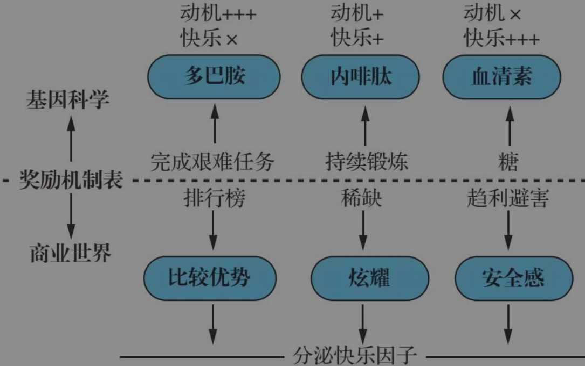

# daily 2025.01.09

》to-do-list

- [x] read
- [ ] sports
- [x] learn English

》my day

--- English Record

    <audio controls style="outline: none;">
        <source src="./asset/20250109.m4a" type="audio/mpeg">
        Your browser does not support the audio element.
    </audio>

---

　　Hello, this is AXiang speaking. Today is January 9th, it was Thursday.Maybe this day is a terrible day. So why? I lost my cigarette. No, I lost my electrical cigarette. When I came to work in the morning, I remember I bring with it. But when I came out of the car, I checked if it was in my pocket or not. But I found it wasn't there. So I guess it was maybe in the car. I asked a favor， I asked my favor for my college to call the taxi driver. But the taxi driver said it was not in the car. It's unbelievable. So I think it was maybe still at home.

　　when I got home in the evening, I found it was not there. So it was lost. Oh, it was a terrible day. Okay, this may be the worst day. I have lost two electrical cigarettes. I swear.， I swear I don't smoke electrical cigarettes anymore. It cost me 1,000 yuan.Too expensive. I think I used... I even... I even don't... I even smoke a little. But it was cost me almost 1,000 to 2,000 yuan。And there is still some “烟弹”  I never use. 

　　Okay. Maybe this is my day.

　　About work. About my job ，Today I..I do a little work. There's nothing for me to do. They are all difficult. I just sit on my chair for a whole day. You know, it's boring. Because it's your job. Maybe your boss will spy on you. And take you out working. So I just pretend ... Working. And... And...And... And... And do my things... Do my things sneaky. Okay. Okay. This is my day. Bye. Bye.

---

goto work ：上班

get off work ：下班

get off the car ：下车

electronic cigarette : 电子烟

--- Chinese Record

说来也是很奇怪，业务的末尾阶段，大家都没什么题可做。这几天，我差不多平均做1道。其实一道也不想做的，但也还是意思意思一下。今天，我早早的做了一道看上去不是很难的题目，然后就打算玩一天。可当我看到那个数据面板的排行榜，半天时间内，有人做了3道，而我的旁边的同事做了2道。搞得我有点不就好意思玩下去了，如果不看那个排行榜，我想我应该可以心安理得的玩下去。所以，这是为什么呢？

游戏里有排行榜，学校里有成绩排名，连微信里都出现了步数排行榜。一旦做出比较机制，也就有了比较优势。就像你今天走的步数不如其他朋友多了，你就会想再多走一会儿，如果步数达到前三名，你就会很开心。

所以，是因为比较优势在作祟？然后让我蠢蠢欲动继续刷题，继续做。不知道是不是它，但和它应该有一定的关系。反正我大概是不会做的，让那些勤奋的人去做，此刻做题的效率，性价比是最低的。

》rethink

》comment

        <link rel="stylesheet" href="https://cdn.jsdelivr.net/npm/gitalk@1/dist/gitalk.css">
        
        

        

